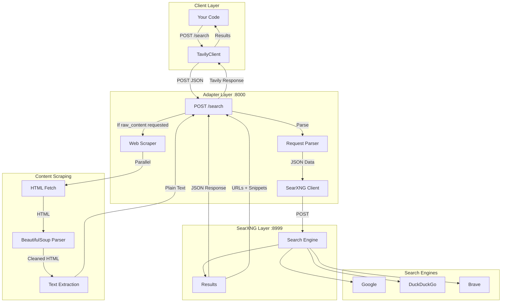
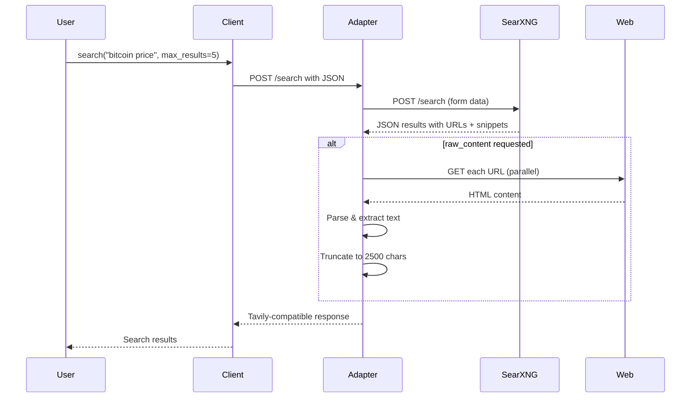
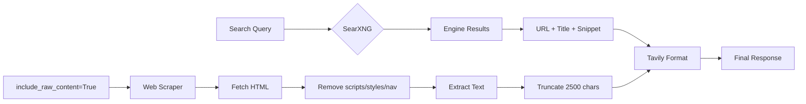

# SearXNG Tavily Adapter

This project is a free Tavily API replacement powered by SearXNG.

## Project Overview

- **Goal**: Provide Tavily-compatible search API with zero cost, no limits, and full privacy
- **Architecture**: FastAPI adapter (port 8000) → SearXNG backend (port 8999) → Multiple search engines
- **Key feature**: `include_raw_content=True` for full page scraping (up to 2500 chars)

## Key Commands

```bash
# Development
docker compose up -d           # Start all services
docker compose logs -f adapter # Watch adapter logs
cd simple_tavily_adapter && python main.py  # Local dev

# Testing
curl -X POST "http://localhost:8000/search" \
     -H "Content-Type: application/json" \
     -d '{"query": "bitcoin price", "max_results": 3}'

python simple_tavily_adapter/test_client.py
```

## Configuration

Single `config.yaml` file with two sections:

```yaml
# SearXNG (root level)
server:
  secret_key: "CHANGE_ME..."
search:
  formats:
    - html
    - json    # Required for API
engines:
  - name: google
    disabled: false

# Adapter (adapter: section)
adapter:
  searxng_url: "http://searxng:8080"
  scraper:
    timeout: 10
    max_content_length: 2500
    user_agent: "Mozilla/5.0 (compatible; TavilyBot/1.0)"
```

## API Usage

```python
from tavily import TavilyClient

# Works identically to official Tavily
client = TavilyClient(base_url="http://localhost:8000")
results = client.search(
    query="machine learning",
    max_results=5,
    include_raw_content=True  # Full page text
)
```

## Development Flow

1. Modify `simple_tavily_adapter/main.py` or `tavily_client.py`
2. Test locally: `python simple_tavily_adapter/main.py`
3. Verify with: `python simple_tavily_adapter/test_client.py`

## Critical Files

- `simple_tavily_adapter/main.py` - FastAPI server implementation
- `simple_tavily_adapter/tavily_client.py` - Python client library
- `simple_tavily_adapter/config_loader.py` - Configuration parsing
- `docker-compose.yaml` - Service orchestration

## Architecture Flow

### System Architecture



### Request Sequence



### Data Flow


